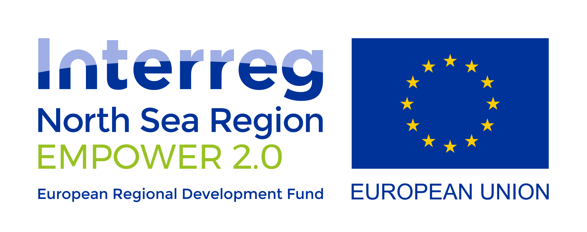

# EMPOWER 2.0

[Prototype](https://empower.jonahgold.dev)

A project for the EMPOWER 2.0 initiative, empowering policy makers all over the North Sea Region to become green energy prosumers. Created by [Jonah Meijers](https://jonahgold.dev), [Rosa Voogd](https://rosavoogd.nl) and [Fleur van Son](https://fleurvanson.com).

## Getting started

This project uses [Snowpack](https://snowpack.dev) for bundling, and [Netlify](https://netlify.com) for deployment and dev server.

It also requires a valid MongoDB URI in a .env file when developing locally, without the database name attached to it. The MongoDB client will automatically look for a database called "empower" at the provided uri.

```shell
$ git clone https://github.com/theonejonahgold/empower
$ cd empower
$ yarn || yarn install || npm install
$ cp .env.example .env
$ echo "MONGO_URI={your_mongodb_uri_here}" > .env
```

### Available commands

```shell
$ yarn start   # Starts snowpack dev server
$ yarn dev     # Starts netlify dev server (with serverless functions support)
$ yarn build   # Builds project to build folder
$ yarn process # Runs dataprocessing/index.js
```

## Tech used

- [Svelte](https://svelte.dev)
- [svelte-routing](https://github.com/EmilTholin/svelte-routing)
- [svelte-loadable](https://github.com/kaisermann/svelte-loadable)
- [D3](https://d3js.org)
- [Ramda](https://ramdajs.com)
- [Ramda-adjunct](https://char0n.github.io/ramda-adjunct/2.30.0/)
- [MongoDB](https://www.npmjs.com/package/mongodb)
- [PostCSS](https://postcss.org)
- [Snowpack](https://snowpack.dev)
- [Prettier](https://prettier.io)
- [Netlify Functions](https://www.netlify.com/products/functions/)

## Graph examples used

- [Radial stacked bar chart by AntonOrlov](https://bl.ocks.org/AntonOrlov/6b42d8676943cc933f48a43a7c7e5b6c)
- [D3 Grouped Bar Chart example](https://observablehq.com/@d3/grouped-bar-chart)
- [Map click to zoom example by Mike Bostock](https://bl.ocks.org/mbostock/2206590)

## Datasets used

- [Kerncijfers wijken en buurten (Core numbers), 2018 (by CBS)](https://www.cbs.nl/nl-nl/maatwerk/2018/30/kerncijfers-wijken-en-buurten-2018)
- [Bodemgebruik (Land usage) per gemeente, 2018 (by CBS)](https://opendata.cbs.nl/statline/?dl=FB31#/CBS/nl/dataset/70262ned/table)
- [Gemeentegrenzen (Municipality borders), 2019 from ArcGIS Hub (by Esri_NL_Content)](https://hub.arcgis.com/datasets/e1f0dd70abcb4fceabbc43412e43ad4b_0)
- [Total renewable, solar, biogas and wind energy generated per municipality (from several sources, gathered by Klimaatmonitor)](https://klimaatmonitor.databank.nl/Jive?workspace_guid=3ca2ab1f-24a6-4b8f-9094-d6cb0a013dd2)

## Data Processing

Data processing is done in the `dataprocessing` folder. Index.js spits out a JSON file that I upload to a dedicated MonoDB atlas database where I can quickly retrieve all the information I need using the serverless functions in the `functions` folder.

### Steps

1. All CSV files get loaded in, core data is being composed
2. Quotes get removed from strings where necessary
3. All subcategories of energy generation (wind, biogas, solar) are combined to the municipalities
4. Land area use is combined to the municipalities
5. Total energy generation is combined to the municipalities
6. Wind and solar projects are combined
7. Unnecessary keys are removed
8. Empty strings are changed to zeroes for the following keys:
    - Wind energy generation (CSV files are a doozy sometimes)
    - Lake area
    - Sea area
    - Agriculture area
    - Living area
9. Location gets added based on other key data points
    - Lake area
    - Sea area
    - Population
10. Data is written to a file, ready to be uploaded to MongoDB where it's savely stored for use inside the app.

### Example municipality

```json
{
  "regio": "Delfzijl",
  "population": 24716,
  "code": 10,
  "codeExtended": "GM0010",
  "households": 11571,
  "regionKind": "Gemeente",
  "municipality": "Delfzijl",
  "totalArea": 22750,
  "livingArea": 598,
  "agricultureArea": 10392,
  "lakeArea": 0,
  "seaArea": 9145,
  "solarEnergyGeneration": 154,
  "windEnergyGeneration": 1046,
  "biogasEnergyGeneration": 0,
  "totalEnergyGeneration": 2075,
  "solarProjects": [
    {
      "nr": 48,
      "gemeente": "Delfzijl",
      "provincie": "Groningen",
      "status": "voorbereiding",
      "realisatiejaar": 2020,
      "dak/grond": "grond",
      "type": "lokale coöperatie",
      "vermogen": 8500,
      "regeling": "onbekend",
    }
  ],
  "windProjects": [
    {
      "nr": 1,
      "gemeente": "Delfzijl",
      "provincie": "Groningen",
      "status": "gerealiseerd",
      "realisatiejaar": 2012,
      "type": "projectcoöperatie",
      "vermogen": 2300,
      "(aan)deelgroterwindpark": "",
    },
    {
      "nr": 2,
      "gemeente": "Delfzijl",
      "provincie": "Groningen",
      "status": "gerealiseerd",
      "realisatiejaar": 2012,
      "type": "projectcoöperatie",
      "vermogen": 2300,
      "(aan)deelgroterwindpark": "",
    }
  ],
  "location": "Coast"
}
```